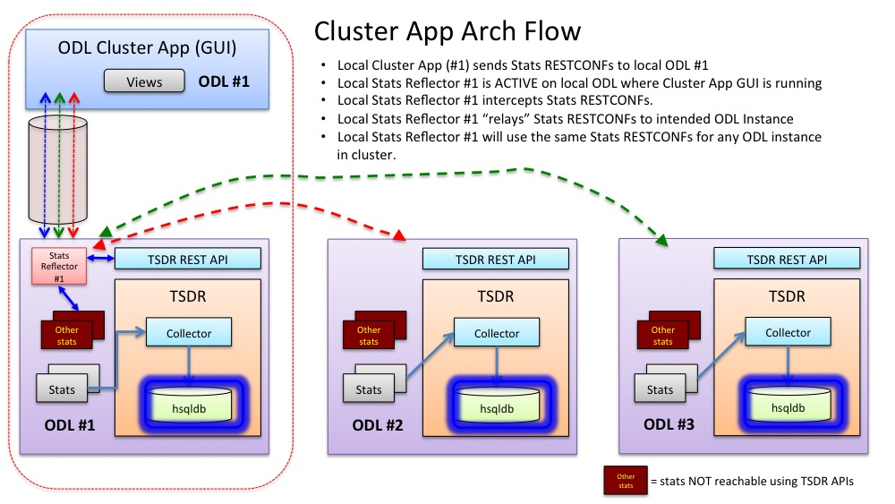

# OpenDaylight Cluster Application and Console

OpenDaylight (ODL) is an open-source application development and delivery platform. ODL nodes can be configured in a cluster so as the provide scalability and resiliency in domains (e.g. IoT network) where it being deployed. The ODL Cluster Application and Console is an app designed to make it much easier for an operator to manage, gather and view configuration and operational data from an ODL cluster.

## Team Members
- Daniel Chai
- Jan Medved
- Chris Metz
- Daniel Malachovsky
- Tyler Levine
- YuLing Chen
- Sharon Aicler

## Overview

ODL Nodes can be configured in a cluster offering scalability and resilency for applications present in different types of domains.
The members of the cluster each generate stats (aka metrics) on their configured and operational state. Independent of the domain, operating a cluster of ODL nodes in particular to gathering stats is currently a no-op. At best scripts can be hacked up to collect and process stats for each node. This is not sustainable and requires way too much effort.

A requirement exists for a simple method that abstracts away the details of the cluster and enables easy collection and visualization of cluster stats. The solution is the ODL Cluster Applications and Console.


The architecture of the application is illustrated in figure 1. Depicted initially is a 3 node cluster.


#Some details regarding the architecture:

- each ODL node is configured with Time Series Data Repository (TSDR) and a database (HSQLDB).


- HSQLDB is shown becuase it is available in ODL. Other databases and their attendent configuration are possible. 


- TSDR interfaces wiht the database to persist stats and presents northbound APIs so apps can read the stats. Any application therefore DOES NOT need details of the specific database internals (i.e. schema). 


- Stats processed by TSDR and stored in the database are specific to the local ODL node only. In other words stats stored in ODL Node #2 are only for ODL Node #2.

- Collector to recognize specific stats and send them to the TSDR. The collector (called controller metrics or collector or CMC)) used with this solution processes stats related to ODL node function (i.e. CPU%, memory consumption, etc.) metrics. Other stats not processed by TSDR can be retrieved. 


 



Figure 1.


## TSDR and ControllerMetricsCollector
TSDR: Time Series Data Repository, more info here: https://wiki.opendaylight.org/view/TSDR:Main

TSDR offers the capability to collect a variety of stats in ODL and persist them in a database. For the Cluster App project, the interest was specifically in using TSDR to collect each ODL node's JVM stats. This was done in the ControllerMetricsCollector feature, which already existed in TSDR but was expanded to support the stats required by the Cluster App project. The following stats are now collected in TSDR:

- CPU Usage (Machine)
- CPU Usage (Controller)
- Heap Memory Usage
- NonHeap Memory Usage
- Current Loaded Classes
- Total Loaded Classes
- Live Thread Count
- Live Daemon Thread Count
- Peak Thread Count 

The ControllerMetricsCollector feature previously used the third-party Sigar library to collect JVM stats, but for the requirements of the Cluster App project (everything has to be packaged within ODL) the Sigar dependency was removed and all the stats are now collected using JVM MBeans.

Example of stat collection:
```
  protected void insertMemorySample() {
    String s = ManagementFactory.getMemoryMXBean().getHeapMemoryUsage().toString();
    int usedIndex = s.indexOf("used");
    long memValue = Integer.parseInt(s.substring(usedIndex + 7, s.indexOf('(', usedIndex)));
    insertToTSDR("Heap:Memory:Usage", "Controller", new BigDecimal(memValue));
  }
```

## Stats Reflector
The Stats Reflector was implemented specifically for the Cluster App project. It takes in requests to collect stats from a particular ODL node in the cluster. This is needed because the UI cannot directly make requests to every ODL node due to the same-origin policy. Therefore, the Stats Reflector runs on one of the ODL nodes (on which the UI also runs), and re-routes requests to the specified ODL node.

The Stats Reflector provides the following RPCs to be used to collect stats (all are POST requests). The header is the same for all:
```
Accept: application/json
Authorization: Basic YWRtaW46YWRtaW4=
Content-Type: application/json
```

### Instrumentation RPC
Returns performance information about all the other RPCs.

Request URL: `http://localhost:8181/restconf/operations/stats-reflector:get-instrumentation`  

Body: 
```
{
  "input": {}
}
```

Response:
```
{
  "output": {
    "requests": [
      {
        "request-name": "GetGeneralRuntimeInfo",
        "number-of-requests": 2,
        "average-latency": "14.5 ms"
      },
      {
        "request-name": "GetShard",
        "number-of-requests": 3,
        "average-latency": "10.333333333333334 ms"
      },
      {
        "request-name": "GetClusterMembers",
        "number-of-requests": 1,
        "average-latency": "28.0 ms"
      },
      {
        "request-name": "GetTsdrStats",
        "number-of-requests": 2,
        "average-latency": "16.5 ms"
      }
    ]
  }
}
```

### Cluster Members RPC
Returns info about cluster members: IP address, name, and local shards.

Request URL: `http://localhost:8181/restconf/operations/stats-reflector:get-cluster-members`  

Body: 
```
{
  "input": {}
}
```

Response:
```
{
  "output": {
    "cluster-members": [
      {
        "member-name": "member-2",
        "member-address": "172.17.0.3",
        "local-shards": [
          "member-2-shard-toaster-operational",
          "member-2-shard-topology-operational",
          "member-2-shard-inventory-operational",
          "member-2-shard-default-operational",
          "member-2-shard-entity-ownership-operational"
        ],
        "voter": true
      },
      {
        "member-name": "member-3",
        "member-address": "172.17.0.4",
        "local-shards": [
          "member-3-shard-toaster-operational",
          "member-3-shard-inventory-operational",
          "member-3-shard-default-operational",
          "member-3-shard-topology-operational",
          "member-3-shard-entity-ownership-operational"
        ],
        "voter": true
      },
      {
        "member-name": "member-1",
        "member-address": "172.17.0.2",
        "local-shards": [
          "member-1-shard-topology-operational",
          "member-1-shard-toaster-operational",
          "member-1-shard-default-operational",
          "member-1-shard-entity-ownership-operational",
          "member-1-shard-inventory-operational"
        ],
        "voter": true
      }
    ]
  }
}
```

### TSDR Stats RPC
Returns TSDR stats for a particular cluster member and metric name. Note: TSDR collects stats every 5 seconds. A request to the stats reflector returns all new data points since the last request was made.

Request URL: `http://localhost:8181/restconf/operations/stats-reflector:get-stats`  

Body: 
```
{
  "input": {
    "cluster-member": "172.17.0.2",
    "data-category": "EXTERNAL",
    "metric-name": "Heap:Memory:Usage",
    "node-id": "Controller:172.17.0.2"
  }
}
```

Response:
```
{
  "output": {
    "data-points": [
      {
        "metric-name": "Heap:Memory:Usage",
        "metric-value": "684140536",
        "time-stamp": "Tue Aug 23 17:36:03 UTC 2016",
        "data-category": "EXTERNAL",
        "node-id": "Controller:172.17.0.2"
      }
    ]
  }
}
```

### GeneralRuntimeInfo MBean RPC
Returns GeneralRuntimeInfo MBean for a particular cluster member and status (operational or config).

Request URL: `http://localhost:8181/restconf/operations/stats-reflector:get-general-runtime-info-mbean`  

Body: 
```
{
  "input": {
    "member-address": "172.17.0.2",
    "status": "operational"
  }
}
```

Response:
```
{
  "output": {
    "transaction-creation-rate-limit": "100.0",
    "timestamp": "1471973775"
  }
}
```

### Shard MBean RPC
Returns Shard MBean for a particular cluster member, status (operational or config), and shard.

Request URL: `http://localhost:8181/restconf/operations/stats-reflector:get-shard-mbean`  

Body: 
```
{
  "input": {
    "member-address": "172.17.0.2",
    "member-name": "member-1",
    "status": "operational",
    "shard": "inventory"
  }
}
```

Response:
```
{
  "output": {
    "follower-info": [
      {
        "time-since-last-activity": "00:00:00.037",
        "match-index": 0,
        "id": "member-3-shard-inventory-operational"
      },
      {
        "time-since-last-activity": "00:00:00.037",
        "match-index": 0,
        "id": "member-2-shard-inventory-operational"
      }
    ],
    "in-memory-journal-log-size": 1,
    "timestamp": "1471973782",
    "last-applied": 0,
    "last-index": 0,
    "pending-tx-commit-queue-size": 0,
    "commit-index": 0,
    "replicated-to-all-index": -1,
    "raft-state": "Leader"
  }
}
```

## GUI - Metz
- mockups
- screenshots

## Pointers to Additional References
- OpenDaylight Clustering: https://wiki.opendaylight.org/view/Running_and_testing_an_OpenDaylight_Cluster
- MD-SAL Clustering Internals: http://events.linuxfoundation.org/sites/events/files/slides/MD-SAL%20Clustering%20Internals.pdf
- TSDR Getting Started: https://wiki.opendaylight.org/view/TSDR_Getting_Started
- TSDR User Guide: https://github.com/opendaylight/docs/blob/master/manuals/user-guide/src/main/asciidoc/tsdr/tsdr-user-guide.adoc
- TSDR Query API Design: https://wiki.opendaylight.org/view/TSDR_Query_API_Design
